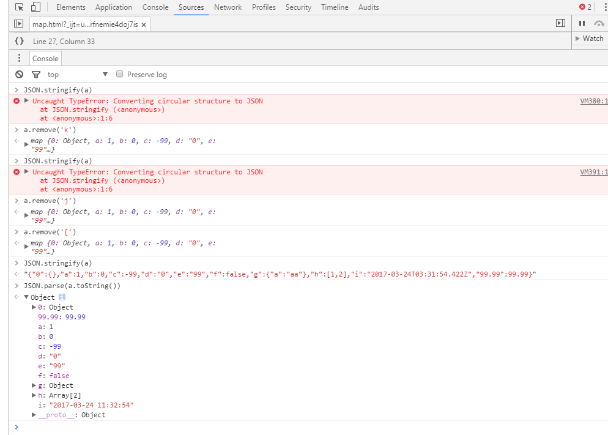

# javascript-map
``` javaScript
var a = new map();
a.put('a', 1);
a.put('b', 0.00); 
a.put('c', -99);
a.put('d', '0');
a.put('e', "99");
a.put('f', false);
a.put('g', {a: 'aa'});
a.put('h', [1, 2]);
a.put('i', new Date());
a.put('j', a); 
a.put(0.00, {});
a.put('[', a); 
a.put('k', document.createElement('div'));
a.put({}, {}); 
a.put([], {}); 
a.toString(); 
var s = a.toString(); 
console.log(s);

"{"a":1,"b":0,"c":-99,"d":"0","e":"99","f":false,"g":{"a":"aa"},"h":[1,2],"i":"2017-03-24 11:32:54","j":"this map","[":"this map","k":"<div></div>","0":{}}"
```

